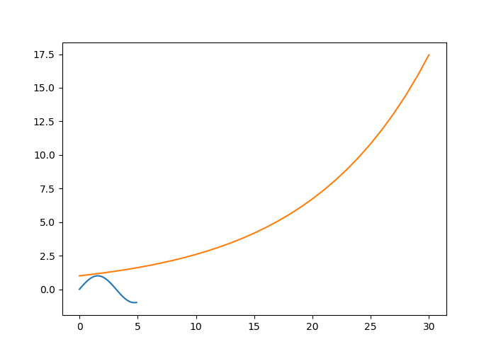

This document contains dabbling with the models presented in Hiroki Sayama's complexity book, as well as some random excursions to nonlinearities.

```{r setup, include=FALSE, eval = FALSE}
library(pacman)
p_load(knitr, tidyverse, zoo)

knitr::opts_chunk$set(echo = TRUE,
                      engine.path = list(
  python = "C:/Program Files/Python36/python.exe"),
  root.dir = ".",
  fig.path="Figures/")

knitr::opts_knit$set(root.dir = ".")
```

```{r, eval = FALSE}
r <- 2.5
x <- 0.2
N <- 500
M <- 100

LogisticMap <- function(r, x, N, M){
  # r: bifurcation parameter
  # x: initial value
  # N: Number of iteration
  # M: Number of iteration points to be returned
  z <- 1:N
  z[1] <- x
  for(i in c(1:(N-1))){
    z[i+1] <- r *z[i]  * (1 - z[i])
  , eval = FALSE}
  # Return the last M iterations 
  z[c((N-M):N)]
, eval = FALSE}

maps <- data.frame(
    "intervention" = LogisticMap(r = 3.9, x = 0.5, N = 400, M = 400) * 100,
    "control" = LogisticMap(r = 3.9, x = 0.4, N = 400, M = 400) * 100)

maps <- maps %>% dplyr::mutate(
  day = 1:400,
  movingAverage_intervention = rollmean(maps$intervention, 7, fill = NA, align = "right"),
  movingAverage_control = rollmean(maps$control, 7, fill = NA, align = "right"),
  # if there are 0 decimals when dividing day by 10, include point:
  every10th_intervention = ifelse(day %% 10 == 0, intervention, NA),
  every10th_control = ifelse(day %% 10 == 0, control, NA)) 

# Data frame containing only three points, to create regression line in the plot:
data2 <- data.frame(y = c(maps$every10th_intervention[10], 
                          maps$every10th_intervention[200],
                          maps$every10th_intervention[390]),
                    x = c(10, 200, 390))

maps %>% ggplot(aes(x = day, y = intervention, group = 1)) +
  # geom_line(colour = "grey") + 
  # geom_line(aes(x = day, y = movingAverage_intervention), colour = "grey", size = 0.75) +
  # geom_line(aes(x = day, y = movingAverage_control), colour = "darkgrey", size = 0.75) +
  # Plot every 10th point, ignoring the fact that there are missings in between:
  geom_line(data = maps[!is.na(maps$every10th_intervention), ], 
            aes(x = day, y = every10th_intervention), color = "darkgrey", size = 0.75) +
  geom_point(data = maps[!is.na(maps$every10th_intervention), ], 
          aes(x = day, y = every10th_intervention), color = "blue", size = 0.8) +
  geom_smooth(method = "lm") +
  # geom_line(data = maps[!is.na(maps$every10th_control), ],
  #          aes(x = day, y = every10th_control), colour = "red", size = 0.75, linetype = "dashed") +
  geom_point(aes(x = 10, y = maps$every10th_intervention[10]), color = "red", size = 2) +
  geom_point(aes(x = 200, y = maps$every10th_intervention[200]), color = "red", size = 2) +
  geom_point(aes(x = 390, y = maps$every10th_intervention[390]), color = "red", size = 2) +
  geom_smooth(data = data2, aes(x = x, y = y), 
              method = "lm", se = FALSE, color = "red", linetype = "dashed") +
  papaja::theme_apa() + 
  scale_y_continuous(name = "Percentage of max motivation") +
  coord_cartesian(xlim = c(0, 400), ylim = c(0, 100))
  

```

```{r, eval = FALSE}

maps %>% ggplot(aes(every10th_intervention)) +
  geom_histogram() +
  papaja::theme_apa()

maps %>% ggplot(aes(intervention)) +
  geom_histogram(binwidth = 1) +
  scale_x_continuous(name = "Percentage of max motivation") +
  papaja::theme_apa()
```

```{r exponential-growth, eval = FALSE}

# Initialize
a <- 0.5

x <- vector()
x[1] <- 1


# Update & observe
for (i in 1:50) {
  x[i + 1] <- a*x[i]
, eval = FALSE}

dyn <- data.frame(rep = seq(1:(i+1)), x)

ggplot(dyn, aes(x = rep, y = x)) +
  geom_line()

```

```{r exponential-growth-time, eval = FALSE}

a <- 1.1

initialize <- function(){
  x <<- 1
  x <<- vector()
  t <- 0
  t <<- vector()
, eval = FALSE}

updateTime <- function(){
  x <<- a * x
  t <<- t + 0.1 
, eval = FALSE}


for (i in 0:3) 
  ifelse(t < 3, c(update(), observe()), break)


a <- 1.1
x <- vector()
x[1] <- 1


# Update & observe
for (i in 1:30) {
  x[i + 1] <- a*x[i]
, eval = FALSE}

dyn <- data.frame(rep = seq(from = 0, to = 3, by = 0.1), x)

ggplot(dyn, aes(x = rep, y = x)) +
  geom_line()

```

## Python code


Example from @HirokiSayama's Introduction to the Modeling and Analysis of Complex Systems

```{python, eval = FALSE} 

import numpy as np 

import matplotlib.pyplot as plt

x = np.arange(0, 5, 0.1); 
y = np.sin(x) 

plt.plot(x, y) 

plt.show()

```

```{python, eval = FALSE} 

import numpy as np 

import matplotlib.pyplot as plt

x = np.arange(0, 5, 0.1); 
y = np.sin(x) 

plt.plot(x, y) 

plt.show()

``` 

```{python, engine = "C:/Python27/python.exe", eval = FALSE}

# To get this far on a uni computer with limited rights to modify directory content (WITH admin rights), I had to...

# 0. Install newest version of Python and make sure it is in the environmental variables path; type "edit the system environment variables" in Start menu, open PATH and see if it contains the python directory.
# 1. Open Command Prompt (press Windows button and r, then type in "cmd", or type it in start menu)
# 2. Type the following commands: 
## pip install -t "C:/a-path-you-can-edit/pythonLibs/" matplotlib
## pip install -t "C:/a-path-you-can-edit/pythonLibs/" numpy
## pip install -t "C:/a-path-you-can-edit/pythonLibs/" scipy
## pip install -t "C:/a-path-you-can-edit/pythonLibs/" networkx
# 3. EITHER: 
## 3a. run the next four lines with code before running what you want to run.
## import sys
## sys.path.append("C:/LocalData/hema/pythonLibs/") # this is the library you chose
## 3b. (Recommended) create a new environmental variable called PYTHONPATH, value of which is your library directory. 

import sys
sys.path.append("C:/LocalData/hema/pythonLibs/") # this is the library you chose

from pylab import *

a = 1.1

def initialize():
    global x, result, t, timesteps
    x = 1.
    result = [x]
    t = 0.
    timesteps = [t]

def observe():
    global x, result, t, timesteps
    result.append(x)
    timesteps.append(t)

def update():
    global x, result, t, timesteps
    x = a * x
    t = t + 0.1

initialize()
while t < 3.:
    update()
    observe()

# matplotlib.pyplot.style.use("ggplot")

plot(timesteps, result)

matplotlib.pyplot.show()

# matplotlib.pyplot.savefig('figures/firstfig')

```

```{python 4.10, engine = "C:/Python27/python.exe", eval = FALSE}

import sys
sys.path.append("C:/LocalData/hema/pythonLibs/") # this is the library you chose

from pylab import *

a = 1.1
b = -3

def initialize():
    global x, result, t, timesteps
    x = 1.
    result = [x]
    t = 0.
    timesteps = [t]

def observe():
    global x, result, t, timesteps
    result.append(x)
    timesteps.append(t)

def update():
    global x, result, t, timesteps
    x = a * x + b
    t = t + 0.1

initialize()
while t < 3.:
    update()
    observe()

# matplotlib.pyplot.style.use("ggplot")

plot(timesteps, result)

matplotlib.pyplot.show()

# matplotlib.pyplot.savefig('figures/firstfig')

```


```{python 4.13-4.14-4.15, engine = "C:/Python27/python.exe", eval = FALSE}

import sys
sys.path.append("C:/LocalData/hema/pythonLibs/") # this is the library you chose

from pylab import *

a = -1.1
b = -90

def initialize():
    global x, y, xresult, yresult
    x = 1.
    y = 1.
    xresult = [x]
    yresult = [y]

def observe():
    global x, y, xresult, yresult
    xresult.append(x)
    yresult.append(y)

def update():
    global x, y, xresult, yresult
    nextx = 0.05 * x + y
    nexty = -0.2 * x + y
    x, y = nextx, nexty

initialize()
for t in xrange(30):
  update()
  observe()

# matplotlib.pyplot.style.use("ggplot")

# plot(xresult, 'b-')
# plot(yresult, 'g--')
# matplotlib.pyplot.show()

plot(xresult, yresult)
matplotlib.pyplot.show()

# matplotlib.pyplot.savefig('figures/firstfig')

```


```{python ex4.8, engine = "C:\\Program Files\\Python36\\python.exe", eval = FALSE}

import sys
sys.path.append("C:\\Program Files\\Python36\\Lib\\site-packages") # this is the library you chose

from pylab import *

def initialize():
    global x, y, xresult, yresult
    x = 1.
    y = 1.
    xresult = [x]
    yresult = [y]

def observe():
    global x, y, xresult, yresult
    xresult.append(x)
    yresult.append(y)

def update():
    global x, y, xresult, yresult
    nextx = x + y
    nexty = x
    x, y = nextx, nexty

initialize()
for t in range(30):
  update()
  observe()

plot(xresult)
matplotlib.pyplot.show()

```
  
```{r fig1, out.width='100%', eval = FALSE}
# 
```


```{python, eval = FALSE}
from pylab import *

a = 1.1

def initialize():
    global x, result, t, timesteps ###
    x = 1.
    result = [x]
    t = 0. ###
    timesteps = [t] ###
    
def observe():
    global x, result, t, timesteps ###
    result.append(x)
    timesteps.append(t) ###

def update():
    global x, result, t, timesteps ###
    x = a * x
    t = t + 0.1 ###

initialize()
while t < 3.: ###
    update()
    observe()

plot(timesteps, result) ###
show()
```

```{python ex4.9-4.9, engine = "C:/Python27/python.exe", eval = FALSE}
import sys
sys.path.append("C:/LocalData/hema/pythonLibs/") # this is the library you chose

from pylab import *

a = 3.49
K = 1.5

def initialize():
    global x, result, t, timesteps
    x = 1.
    result = [x]

def observe():
    global x, result
    result.append(x)
    
def update():
    global x, result
    x = (-((a - 1)/K) * x + a) * x

initialize()
for t in xrange(300):
  update()
  observe()
  
# matplotlib.pyplot.style.use("ggplot")

plot(result)

matplotlib.pyplot.show()
```

```{python ex4.10-UNFINISHED, engine = "C:/Python27/python.exe", eval = FALSE}
import sys
sys.path.append("C:/LocalData/hema/pythonLibs/") # this is the library you chose

from pylab import *

a = 3.49
K = 1.5

def initialize():
    global x, result, t, timesteps
    x = 1.
    result = [x]

def observe():
    global x, result
    result.append(x)
    
def update():
    global x, result
    x = x + r*x * (1-(x/K))

initialize()
for t in xrange(300):
  update()
  observe()
  
# matplotlib.pyplot.style.use("ggplot")

plot(result)

matplotlib.pyplot.show()
```

```{r doodle1, eval = FALSE, eval = FALSE}
x1 <- 0.2
const <- 2.95
x <- vector()
x[1] <- x1

for (i in 1:99) {
  x[i + 1] <- const*x[i]*(1-x[i])
, eval = FALSE}

dyn <- data.frame(rep = seq(1:(i+1)), x)

ggplot(dyn, aes(x = rep, y = x)) +
  geom_point()


A <- 1
B <- 1
A[1] <- A
B[1] <- B

for (i in 1:99) {
  A[i + 1] <- ifelse(B[i] == 1, 1, 0)
  B[i + 1] <- ifelse(A[i] == 0, 1, 0)
, eval = FALSE}

ABdata <- data.frame(step = seq(1:100), A = A, B = B)

ggplot(ABdata, aes(x = step, y = A)) +
  geom_point(fill)

ABplot <- ggplot(ABdata, aes(x = step, y = A, group = 1)) +
  geom_line(colour = "darkred", size = 1) + 
  geom_line(data = ABdata, aes(x = step, y = B), colour = "darkblue", size = 1) +
  theme_classic() + 
  scale_y_discrete(name = "Color") +
  coord_cartesian(xlim = c(0, 100), ylim = c(0, 2))

```

